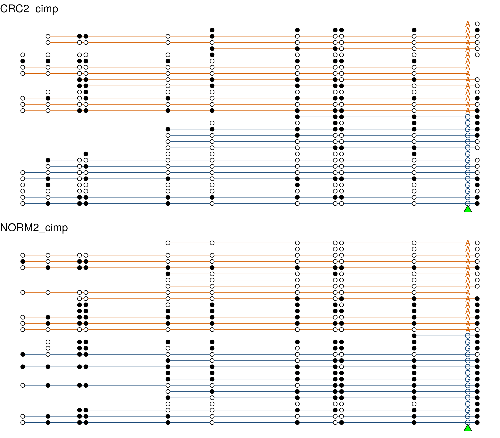
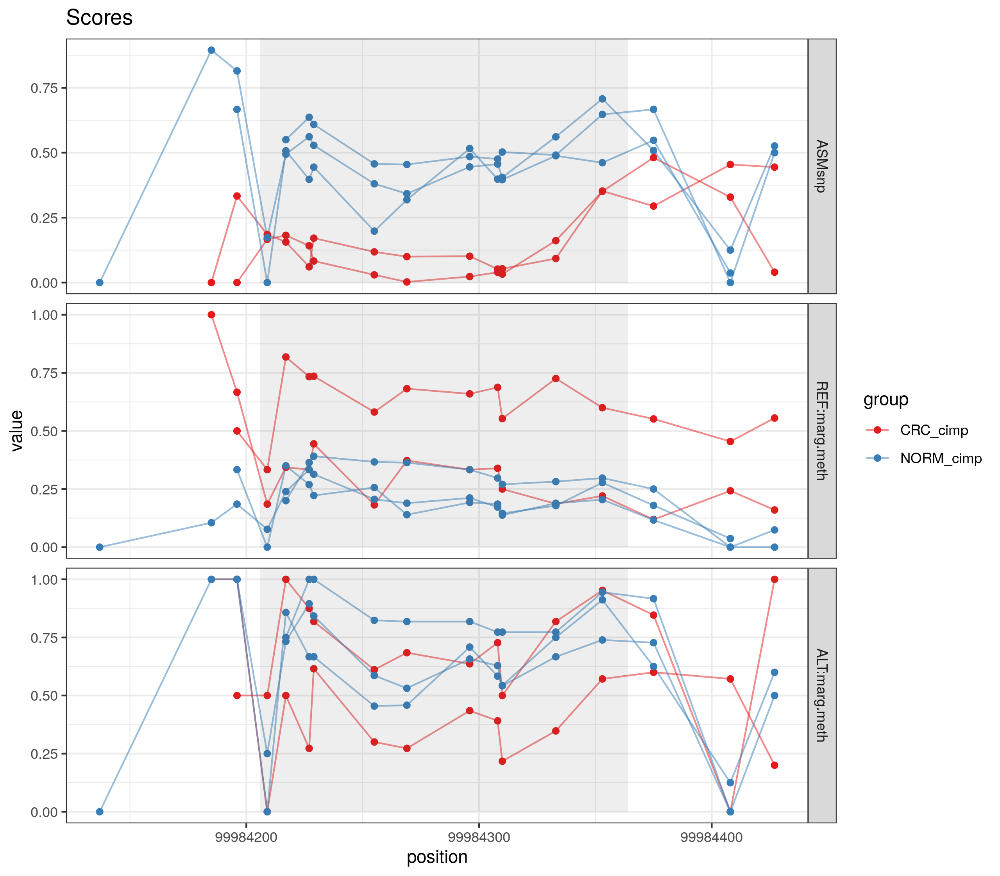
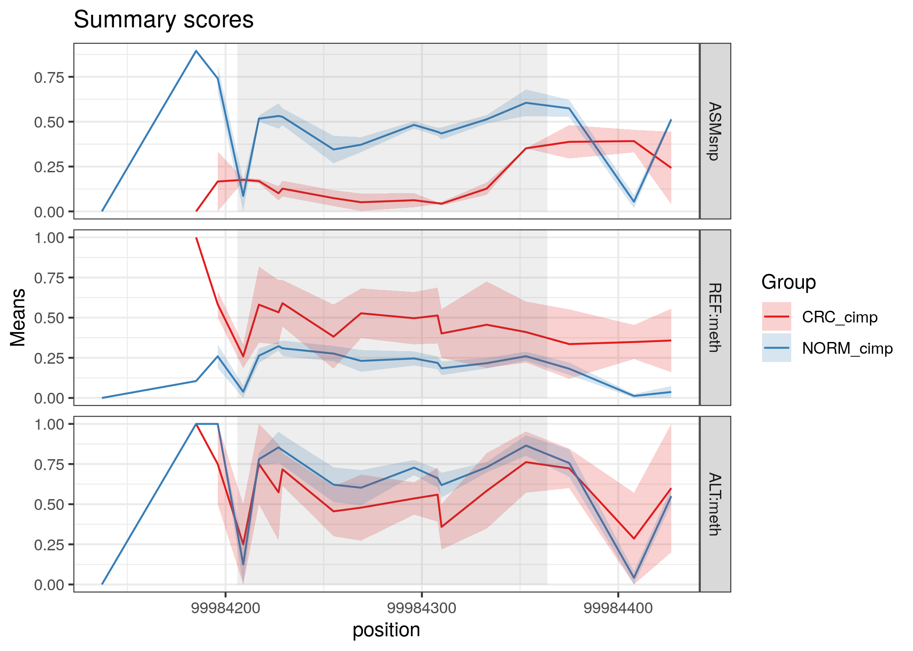
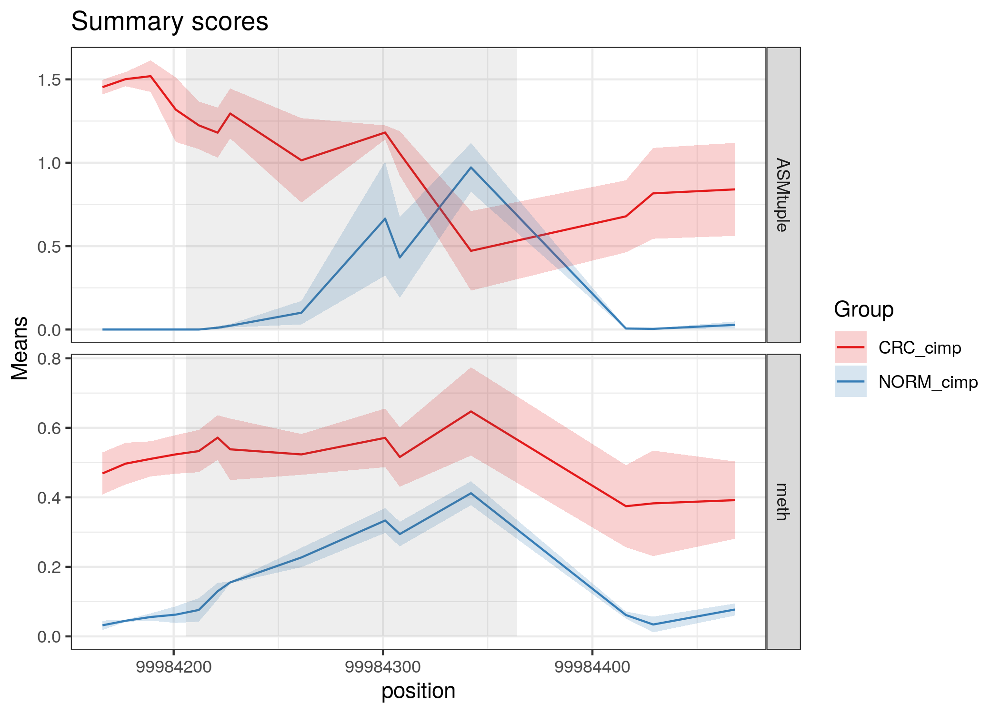

<!--- [](https://travis-ci.com/csoneson/rnaseqworkflow) -->

# DAMEfinder 

**DAMEfinder** (**D**ifferential **A**llele-specific **ME**thylation **finder**) is an R-package that detects allele-specific methylation (ASM) in a cohort of samples, and detects regions of differential ASM within groups of interest, based on **Bisulfite-sequencing** files.

DAMEfinder runs in two modes: **SNP-based** (exhaustive-mode) and **tuple-based** (fast-mode), which converge when calculating differential methylation.


Please refer to the vignette for more details on running the pipeline. 
[Preprint out!](https://www.biorxiv.org/content/10.1101/800383v1)

## What mode should I choose?

It depends on what you want to do and how much time you have. Either way you have to align your reads with [Bismark](https://github.com/FelixKrueger/Bismark) (apologies to other-aligner users).

### SNP-based

To run the **SNP-based** mode you need processed `bam` files *AND* a VCF file for each of your samples with heterozygous SNPs. I know this is typically not the case, so you could alternatively extract heterozygous SNPs using [BisSNP](https://github.com/dnaase/Bis-tools/tree/master/Bis-SNP) (which I have used), or [biscuit](https://github.com/zwdzwd/biscuit) (which I will test at some point).

I call this the "exhaustive-mode" because it extracts an ASM score for every CpG site in the reads containing each SNP from the VCF file. Based on this score DAMEs are detected.

From a biological point of view, you might want to run this mode if you are interested in loss or gain of allele-specificity linked to somatic heterozygous SNPs. More specifically, you could detect genes that exhibit loss of imprinting (e.g. [in colorectal cancer](http://cancerres.aacrjournals.org/content/62/22/6442.long)).

### tuple-based

To run the **tuple-based** mode you have to run [methtuple](https://github.com/PeteHaitch/methtuple) first. The methtuple output is the only thing needed for this mode. 

I call this the fast-mode because you don't need SNP information. The assumption is that intermediate levels of methylation represent ASM along the genome. For example, we have shown that the ASM score can distinguish females from males in the X chromosome. Using SNP information this wouldn't be possible.

### What does that look like?

1. **SNP-based** ASM is sequence dependent, therefore to draw ASM I split the reads (horizontal lines) by allele, a bit like this:



This is a (not so great) example of differential SNP-ASM. There is gain of ASM in CR-cancer tissue (CRC2_cimp). The reads shown are a random subset of the total. You could plot all the reads if you like.

The actual ASM scores in this region, as well as the methylation level per allele for several samples looks like this:



or summarized by means:



2. **tuple-based** ASM only relies on the reads.

We can look at the tuple ASM scores in the same region as above, as well as the overall methylation (beta-values) for several samples:




## How do I install it?

Since DAMEfinder is not on Bioconductor, you have to install all dependencies before:

```{r}
## Install `BiocManager` if needed
if (!("BiocManager" %in% installed.packages()[, "Package"])) {
  install.packages("BiocManager")
}

## List dependencies
pkg <- c("BiocGenerics", "GenomeInfoDb", "GenomicRanges", "IRanges", 
"SummarizedExperiment", "limma", "bumphunter", "readr", 
"Rsamtools", "ggplot2",)

## Check if dependencies are already installed
pkg <- pkg[!(pkg %in% installed.packages()[, "Package"])]

## If some dependency is missing, install it
if (length(pkg) > 0) {
	BiocManager::install(pkg, dependencies = TRUE, ask = FALSE)
}
```

Now you can install DAMEfinder

```{r}
BiocManager::install("markrobinsonuzh/DAMEfinder")
```

## Feedback

If you have problems installing, running, or just have questions regarding the package or theory behind it, please open an issue and I will answer as soon as possible. 
