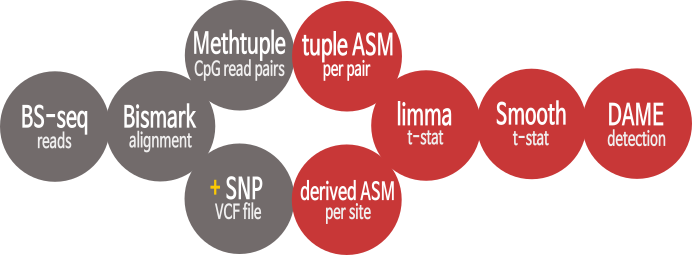

```{r setup, include=FALSE}
knitr::opts_chunk$set(cache = 0, fig.path = "figure/", fig.width = 6, 
                      fig.height = 7)
```

```{r style, echo = FALSE, results = 'asis'}
BiocStyle::markdown()
```

# What is allele-specific methylation?

The phenomenon occurs when there is an asymmetry in methylation between one
specific allele and the alternative allele [@hu2013]. The best studied example
of allele-specific methylation (ASM) is genomic imprinting. When a gene is
imprinted, one of the parental alleles is hyper-methylated compared to the other
allele, which leads to parent-allele-specific expression. This asymmetry is
conferred in the gametes or very early in embryogenesis, and will remain for the
lifetime of the individual [@kelsey2013; @hanna2014]. ASM not related to
imprinting or "secondary imprinting", exhibits parental-specific methylation,
but is not inherited from the germline [@hanna2017]. Another example of ASM is X
chromosome inactivation in females, where methylation coordinates the "random"
silencing of the X chromosome. DAMEfinder detects ASM for several
bisulfite-sequenced (BS-seq) samples in a cohort, and performs differential
detection for regions that exhibit loss or gain in ASM.


# Overview

We focus on any case of ASM in which there is an imbalance in the methylation
level between two alleles, regardless of its origin.

DAMEfinder runs in two modes: **SNP-based** (exhaustive-mode) and
**tuple-based** (fast-mode), which converge when differential ASM is detected:

```{r, echo=FALSE, out.width='250%', fig.align='center'}

```

## Why **SNP-based**?
We call this the "exhaustive-mode" because it extracts an ASM score for every
CpG site in the reads containing the SNPs in a VCF file. Based on this score,
DAMEs are detected. From a biological point of view, you might want to run this
mode if you are interested in loss or gain of allele-specificity linked to
somatic or germline heterozygous SNPs. More specifically, you could detect genes
that exhibit loss of imprinting (e.g. as in colorectal cancer [@cui2002]).

## Why **tuple-based**?
To run the **tuple-based** mode you have to run
[methtuple](https://github.com/PeteHaitch/methtuple) first [@hickey2015]. The
methtuple output is the only thing needed for this mode. I call this the
fast-mode because you don't need SNP information. The assumption is that
intermediate levels of methylation represent ASM along the genome. For example,
we have shown (paper in prep) that the ASM score can distinguish females from
males in the X chromosome. Using SNP information this wouldn't be possible.

# Get bam files 
In order to run any of the two modes, you must obtain aligned bam files using
[`bismark`](http://www.bioinformatics.babraham.ac.uk/projects/bismark/). Here we
demonstrate how to generate these starting from paired-end fastq files of
bisulfite-treated reads:

```{bash eval=FALSE}
#Check quality of reads
fastqc -t 2  sample1_R1.fastq.gz sample1_R2.fastq.gz
	
#Trim reads to remove bad quality regions and adapter sequence
trim_galore --paired sample1_R1.fastq.gz sample2_R2.fastq.gz
```

To trim the reads we use [`Trim
Galore`](https://github.com/FelixKrueger/TrimGalore) and specify the use of
paired reads. By default it will remove any adapter sequence it recognizes.
Please refer to the [user
guide](https://github.com/FelixKrueger/TrimGalore/blob/master/Docs/Trim_Galore_User_Guide.md)
for further specifications.

```{bash eval=FALSE}
#Build bisulfite reference 
bismark_genome_preparation <path_to_genome_folder>

#run Bismark
bismark -B sample1 --genome <path_to_genome_folder> 
    -1 sample1_R1_val_1.fq.gz 
    -2 sample1_R2_val_2.fq.gz

#deduplicate (optional)
deduplicate_bismark -p --bam sample1_pe.bam

#sort and index files
samtools sort -m 20G -O bam -T _tmp 
    -o sample1_pe.dedupl_s.bam sample1_pe.deduplicated.bam
samtools index file1_pe.dedupl_s.bam
```

Before the alignment, you must download a reference fasta file from
[Ensembl](https://www.ensembl.org/info/data/ftp/index.html) or
[Gencode](https://www.gencodegenes.org/), and generate a bisulfite converted
reference. For this we use `bismark_genome_preparation` from the `bismark`
suite, and specify the folder that contains the fasta file with its index
file. Depending on the library type and kit used to obtain the reads, you may
want to deduplicate your bam files (e.g. TruSeq). Please refer to the [user
guide](https://rawgit.com/FelixKrueger/Bismark/master/Docs/Bismark_User_Guide.html)
for further explanation and specifications.


# SNP-based (aka slow-mode)

To run the SNP-based mode, you need to additionally have a VCF file including
the heterozygous SNPs per sample. If you do not have this, we recommend using
the tuple-based mode, or running
[`Bis-SNP`](http://people.csail.mit.edu/dnaase/bissnp2011/) to obtain variant
calls from bisulfite-converted reads.
<!-- include example to run Bis-SNP? -->

## Example Workflow 

In this example we use samples from two patients with colorectal cancer from a
published dataset [@parker2018]. For each patient two samples were taken:
`NORM#` corresponds to normal mucosa tissue and `CRC#` corresponds to the paired
adenoma lesion. Each of these samples was sequenced using targeted BS-seq
followed by variant calling using `Bis-SNP`.

### Obtain allele-based methylation calls

Similar to the `bismark_methylation_extractor`, we obtain methylation calls.
However since we are interested in allele-specific methylation, we only extract
methylation for CpG sites that fall within reads including a SNP. For every SNP
in the VCF file an independent methylation call is performed by using
`extract_bams`, which "extracts" reads from the bam file according to the
alleles, and generates a `list` of `GRangesList`s:

```{r}
suppressPackageStartupMessages({
  library(DAMEfinder)
  library(SummarizedExperiment)
  library(GenomicRanges)
  })

bam_files <- c(system.file("extdata", "NORM1_chr19_trim.bam", 
                           package = "DAMEfinder"),
               system.file("extdata", "CRC1_chr19_trim.bam", 
                           package = "DAMEfinder"))

vcf_files <- c(system.file("extdata", "NORM1.chr19.trim.vcf", 
                           package = "DAMEfinder"),
               system.file("extdata", "CRC1.chr19.trim.vcf", 
                           package = "DAMEfinder"))

sample_names <- c("NORM1", "CRC1")

reference_file <- system.file("extdata", "19.fa", package = "DAMEfinder")

#Extract reads and extract methylation according to allele
snp.list <- extract_bams(bam_files, vcf_files, sample_names, reference_file,
                       coverage = 2)

#CpG sites for first SNP in VCF file from sample NORM1
snp.list$NORM1[[1]]

#CpG sites for first SNP in VCF file from sample CRC1
snp.list$CRC1[[1]]

```

For demonstration, we include bam files from chromosome 19, and shortened VCF
files. Typically we would run the function on an entire bam and VCF file, which
would generate a large output.

The function also takes as input the reference file used to generate the
alignments. For demonstration we use chromosome 19 of the `GRCh37.91` reference
fasta file.

### Summarize methylation calls across samples

We use `calc_derivedasm()` to generate a `RangedSummarizedExperiment` from the
large list we generated above:

```{r}

derASM <- calc_derivedasm(snp.list)

derASM
assays(derASM)
```

Every row in the object is a single CpG site, and each column a sample. It 
contains 6 matrices in `assays`:

* `der.ASM`: A derived SNP-based ASM defined as $abs(\frac{X^{r}_M}{X^{r}} -
\frac{X^{a}_M}{X^{a}})$, where $X$ is the coverage in the reference $r$ or
alternative allele $a$, and $X_M$ the number of methylated reads in $r$ or $a$.
Basically, CpG sites with values of 1 or close to 1 have more
allele-specificity. ASM of 1 represents the perfect scenario in which none of
the reads belonging to one allele are methylated, and the reads of the other
allele are completely methylated.

* `snp.table`: Location of the SNP associated to the CpG site.

* `ref.cov`: Coverage of the "reference" allele.

* `alt.cov`: Covearage of the "alternative" allele.

* `ref.meth`: Methylated reads from the "reference" allele.

* `alt.meth`: Methylated reads from the "alternative" allele.

You can access these assays as:

```{r}
x <- assay(derASM, "der.ASM")
head(x)
```

<!-- ### Get t-Statistics per site -->

<!-- Next, we obtain a moderated t-statistic per CpG site using `limma`. The -->
<!-- statistic reflects a measure of difference between the two conditions being
--> <!-- compared, in this case normal Vs cancer. The t-statistic is optionally
smoothed --> <!-- using `bumphunter`. -->
<!-- For each condition being compared, we recommend at least three biological
--> <!-- replicates. This ensures enough biological variability to calculate
residual --> <!-- degrees of freedom in the linear model fit. -->


### Find DAMEs

Now we detect regions that show differential ASM. The function `find_dames()`
performs several steps:

 1. Obtains a moderated t-statistic per CpG site using `lmFit()` and `eBayes()`
 from the `limma` package. The statistic reflects a measure of difference
 between the conditions being compared, in this case normal Vs cancer. The
 t-statistic is optionally smoothed (`smooth` parameter).
 
 After this, two methods can be chosen (`pvalAssign` parameter):
 
 * Simes method: 
    2. (Default) Clusters of CpG sites are determined by closeness (`maxGap`),
    and a p-value for each cluster is calculated using the simes method, similar
    to the package `csaw` from @lun2014. With this approach, the p-value
    represents evidence against the null hypothesis that no sites are
    differential in the cluster.
    
  * Bumphunting method:
    2. CpG sites with a t-statistic above and below a certain cutoff (set with
    `Q`), are grouped into segments (after being clustered). This is done with
    the `regionFinder()` function from `bumphunter` [@jaffe2012].
    3. For each of these segments, a p-value is calculated empirically by
    permuting the groups (covariate) of interest. Depending on the number of
    samples, this can take longer than the Simes method. However the number of
    permutations can be controlled with `maxPerms`.
 

Here we show an example with a pre-processed set of samples: 4 colorectal cancer
samples, and their paired normal mucosa:

```{r}

data(extractbams_output)

#The data loaded is an output from `split_bams()`, therefore we run 
#`calc_derivedasm` to get the SummarizedExperiment
derASM <- calc_derivedasm(extractbams_output, cores = 1, verbose = FALSE)

#We remove all CpG sites with any NA values, but not 0s
filt <- rowSums(!is.na(assay(derASM, "der.ASM"))) == 8 
derASM <- derASM[filt,]

#set the design matrix
grp <- factor(c(rep("CRC",4),rep("NORM",4)), levels = c("NORM", "CRC"))
mod <- model.matrix(~grp)
mod

#Run default
dames <- find_dames(derASM, mod)

head(dames)

#Run empirical method
dames <- find_dames(derASM, mod, pvalAssign = "empirical")

head(dames)

```

A significant p-value represent regions where samples belonging to
one group (in this case the cancer samples), gain or lose allele-specificity
compared to the other group (here the normal group).

# tuple-based (aka fast-mode)

Before running the tuple-based mode, you must obtain files from the `methtuple`
tool to input them in the `read_tuples` function.


## Run Methtuple on bam files

Methtuple requires the input `BAM` files of paired-end reads to be sorted by
query name. For more information on the options in `methtuple`, refer to the
user [guide](https://github.com/PeteHaitch/methtuple). For example the `--sc`
option combines strand information.

```{bash, eval=FALSE}

# Sort bam file by query name
samtools sort -n -@ 10 -m 20G -O bam -T _tmp 
    -o sample1_pe_sorted.bam sample1_pe.deduplicated.bam

# Run methtuple
methtuple --sc --gzip -m 2 sample1_pe_sorted.bam
```


## Example Workflow 

### Read methtuple files 

We use the same samples as above to run `methtuple` and obtain `.tsv.gz` files.
We read in these files using `read_tuples` and obtain a list of `tibble`s, each
one for every sample:

```{r}
tuple_files <- c(system.file("extdata", "NORM1_chr19.qs.CG.2.tsv.gz", 
                             package = "DAMEfinder"),
                 system.file("extdata", "CRC1_chr19.qs.CG.2.tsv.gz", 
                             package = "DAMEfinder"))

sample_names <- c("NORM1", "CRC1")

tuple_list <- read_tuples(tuple_files, sample_names)

head(tuple_list$NORM1)
```

Each row in the `tibble` displays a tuple. The chromosome name and strand are
shown followed by `pos1` and `pos2`, which refer to the genomic positions of the
first and second CpG in the tuple. The `MM`, `MU`, `UM`, and `UU` counts of the
tuple are displayed where `M` stands for methylated and `U` for unmethylated.
For example, `UM` shows the read counts for the instances where `pos1` is
unmethylated and `pos2` is methylated. The coverage and distance between the two
genomic positions in the tuple are shown under `cov` and `inter_dist`
respectively.


### Calculate ASM Score

The `calc_asm` function takes the output from `read_tuples()`, and as in the
SNP-based mode, generates a `RangedSummarizedExperiment` where each row is a
tuple and each column is a sample. The object contains 6 assays including the
`MM`, `MU`, `UM`, and `UU` counts, as well as the total coverage and the
tuple-based ASM score. This score is a measure of ASM calculated directly from
the reads without the need of SNP information. Because of this, it is a lot
quicker than the SNP-based ASM, and is useful for more explorative purposes.

Equations \@ref(eq:asmGeneral), \@ref(eq:asmWeight) and \@ref(eq:asmTheta) show
how the score is calculated. The log odds ratio in equation \@ref(eq:asmGeneral)
provides a higher score the more `MM` and `UU` counts the tuple has, whereas a
higher `UM` and `MU` would indicate "random" methylation. The weight further
adds allele-specificity where a rather balanced MM:UU increases the score.

\begin{equation}
    ASM^{(i)} = log{ \Big\{ \frac{X_{MM}^{(i)} \cdot X_{UU}^{(i)}}{X_{MU}^{(i)}
    \cdot X_{UM}^{(i)}} \Big\} \cdot w_i }
    (\#eq:asmGeneral)
\end{equation}

\begin{equation}
    w_i = P(0.5-\epsilon < \theta < 0.5+\epsilon~|~ X_{MM}^{(i)}, X_{UU}^{(i)},
    \beta_1, \beta_2)
    (\#eq:asmWeight)
\end{equation}

\begin{equation}
    \theta^{(i)} | X_{MM}^{(i)}, X_{UU}^{(i)},\beta_1, \beta_2 \sim
    Beta(\beta_1+X_{MM}^{(i)}, \beta_2+X_{UU}^{(i)})
    (\#eq:asmTheta)
\end{equation}


where $\theta^{(i)}$ represents the moderated proportion of MM to MM+UU alleles.
The weight, $w_i$ is set such that the observed split between MM and UU alleles
can depart somewhat from 50/50, while fully methylated or unmethylated tuples,
which represents evidence for absence of allele-specificity, are attenuated to
0.  The degree of allowed departure can be set according to $\epsilon$, the
deviation from 50/50 allowed and the level of moderation, $\beta_1$ and
$\beta_2$.

```{r}

ASM_mat <- calc_asm(tuple_list)
ASM_mat
```

<!-- ### Remove tuples without a SNP -->
<!-- Some of the tuples obtained above might have a good ASM score, however in
some cases, this is no guarantee that the ASM is linked to an actual SNP.
Because of this and to reduce the number of false positives, you can remove CpG
sites that are "far away" from a SNP. Since in the **tuple-based mode** we
assume you do not have `VCF` files of your samples, what you can get is a common
set of variants.  -->

<!-- Here we include some options to obtain such a `VCF` file: -->

<!-- * From
[dbSNP](https://www.ncbi.nlm.nih.gov/variation/docs/human_variation_vcf/), or
its [ftp
site](ftp://ftp.ncbi.nih.gov/snp/organisms/human_9606_b150_GRCh37p13/VCF/). -->
<!-- * From [ensembl](http://www.ensembl.org/info/data/ftp/index.html), or its
[ftp
site](ftp://ftp.ensembl.org/pub/grch37/release-91/variation/vcf/homo_sapiens/).
-->

<!-- Next, you can load that file into R with `vcfR`. For more info on this
package click [here](https://knausb.github.io/vcfR_documentation/index.html):
-->

<!-- ```{r, eval =F} -->
<!-- library(vcfR) -->
<!-- vcf <-
read.vcfR("../../Shared_taupo/steph/reference/common_all_20170710.vcf") -->
<!-- vcf <- getFIX(vcf) -->
<!-- ``` -->

<!-- This way we get a matrix version of the `VCF` file.  -->

<!-- Next we make a GRanges object from the vcf, and extract the GRanges from
the SummarizedExperiment. -->

<!-- ```{r, eval=FALSE} -->

<!-- GRvcf <- GRanges(vcf[,1],IRanges(as.numeric(vcf[,2]), width = 1)) -->
<!-- rm(vcf) #because it's too heavy -->

<!-- GRasm <- rowRanges(ASM_mat) -->
<!-- ``` -->

<!-- Since we want to keep tuples within a certain proximity of a variant, we
grab 50 base pairs up and downstream from the SNP and filter the
SummarizedExperiment to keep the CpG tuples within this window. You can change
the size of the window depending on for example the read lenght in your data:
-->

<!-- ```{r, eval=FALSE} -->

<!-- #Set 100 bp window (read length) from the SNP -->
<!-- GRvcf <- GenomicRanges::promoters(GRvcf, upstream=50, downstream=50) -->

<!-- #Filter tuples  -->
<!-- over <- GenomicRanges::findOverlaps(GRasm, GRvcf) -->
<!-- ASM_mat <- ASM_mat[unique(S4Vectors::queryHits(over)),] -->
<!-- ``` -->


### Find DAMEs

As above, the `RangedSummarizedExperiment` is used to detect differential ASM.
Here we show an example with a pre-processed set of samples: 3 colorectal cancer
samples, an 2 normal mucosa samples

```{r}
#load package data
data(readtuples_output)

#run calc_asm and filter object
ASMscore <- calc_asm(readtuples_output)
filt <- rowSums(!is.na(assay(ASMscore, "asm"))) == 5 #filt to avoid warnings
ASMscore <- ASMscore[filt,]

#make design matrix
grp <- factor(c(rep("CRC",3),rep("NORM",2)), levels = c("NORM", "CRC"))
mod <- model.matrix(~grp)

#run default and increase maxGap to get longer, more sparse regions
dames <- find_dames(ASMscore, mod, maxGap = 300)

head(dames)

#run alternative mode
dames <- find_dames(ASMscore, mod,  maxGap = 300, pvalAssign = "empirical")

head(dames)

```


# Visualization

## Methyl-circle plot

A typical way of visualizing ASM is to look at the reads overlapping a
particular SNP, and the methylation state of the CpG sites in those reads (black
circles for methylated and white for unmethylated, see @shoemaker2010 for
examples). Here we offer this option with the function `methyl_circle_plot()`.
As input it takes a `GRanges` with the SNP of interest, and the bam, VCF and
reference files as in the `extract_bams()` function.

```{r, fig1}
snp <- GRanges(19, IRanges(267039, width = 1))

snp

bam.file <- system.file("extdata", "CRC1_chr19_trim.bam", 
                        package = "DAMEfinder")

vcf.file <- system.file("extdata", "CRC1.chr19.trim.vcf", 
                        package = "DAMEfinder")

ref.file <- system.file("extdata", "19.fa", package = "DAMEfinder")

methyl_circle_plot(snp = snp, vcfFile = vcf.file, bamFile = bam.file, 
                   refFile = ref.file)
```

If you are interested in a specific CpG site within this plot, you can include
an extra `GRanges` with its location, and the triangle at the bottom will point
to it:

```{r, fig2}

cpgsite <- GRanges(19, IRanges(266998, width = 1))

methyl_circle_plot(snp = snp, vcfFile = vcf.file, bamFile = bam.file, 
                   refFile = ref.file, cpgsite = cpgsite)
```

If you are instead interested in reads overlapping a CpG site, you can use
`methyl_circle_plotCpG()`, which is useful if you run the tuple-mode:

```{r, fig3}

cpgsite <- GRanges(19, IRanges(266998, width = 1))

methyl_circle_plotCpG(cpgsite = cpgsite, bamFile = bam.file, 
                      refFile = ref.file)
```

You can also limit both the SNP plot and the CpG plot to a specific window of
interest (to zoom in or out), say for example after you have identified a DAME:

```{r, fig4}

#the DAME we identified up in section 4.1.3
dame <- GRanges(19, IRanges(388278,388350))

#To find the SNP(s) in this DAME
index <- which(start(derASM) == 388278)

#Here all samples share the SNP (which is nice)
assay(derASM, "snp.table")[index,]

#put SNP in GRanges
snp <- GRanges(19, IRanges(388413, width = 1)) #always set the width if your 
#GRanges has 1 site

#as expected, this DAME is not really good (given the high p-value)
methyl_circle_plot(snp = snp, vcfFile = vcf.file, bamFile = bam.file, 
                   refFile = ref.file, dame = dame)

```


## MDS plot

To plot a multidimensional scaling plot (MDS), we provide a wrapper to
`plotMDS()` from `limma`, which adjusts the ASM score to calculate the euclidean
distances. The input is the `SummarizedExperiment`, and the vector of covariates
to color the points by:

```{r, fig5}

methyl_MDS_plot(ASMscore, group = grp, color = 1:2)

```


## Generate bigWig files

You can generate `bigWig` files for each sample, containing either the SNP-based
or the tuple-based scores by running `make_bigwig()`. This function only works
as long as `bedGraphToBigWig` is installed in a LINUX or mac-based sytem.

```{r, fig6, eval=FALSE}

#path to chrom.sizes file
chromsizes <- system.file("extdata", "hg19.chrom.sizes.mod", 
                          package = "DAMEfinder")

#For a single sample
make_bigwig(samples = "NORM1", scoreObj = derASM, folder = "", 
            chromsizes.file = chromsizes)

#For all samples in object
sapply(colnames(derASM), make_bigwig, scoreObj = derASM, folder = "", 
       chromsizesFile = chromsizes)

```

# References
